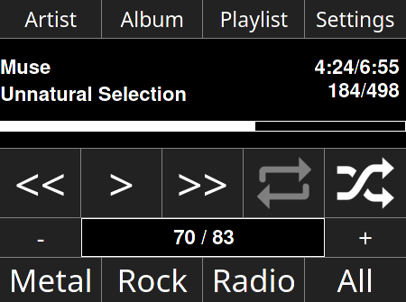
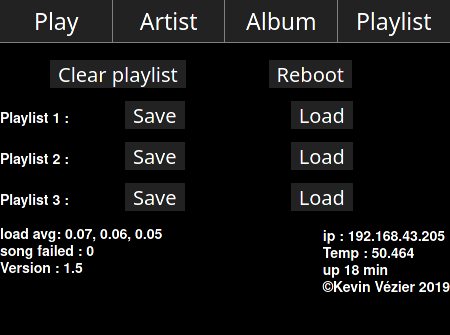

# MPD UI for PI

## Function





### Feature

Filter by :
 - Artist
 - Album

## Installation

Not all information here, i make this a long time ago, i don't remember everything :/

`sudo apt install  git xorg matchbox-window-manager chromium-browser-l10n`


in /root/.profile
```
if [[ ! $SSH_CLIENT ]]; then
  exec startx
fi

```

in /root/xinitrc
```
xset s off
xset -dpms
matchbox-window-manager -use_cursor no -use_titlebar no &
while true; do
	chromium-browser --app=http://127.0.0.1/ --no-sandbox
done

```


## Auto off for bluetooth autoradio

```
#!/bin/bash
bt_mac_address='00:03:19:FF:FF:FF'
bt_name='Peugeot'

if [[  -f  /tmp/stop_bt  ]];
then
	while (true)
	do
	
		hcitool name $bt_mac_address |grep $bt_name;
		if [[ $? != 0 ]]
		then
			i=5;
			found=false;
			while  [[ $i -gt 0 ]]
			do
			        hcitool name $bt_mac_address |grep $bt_name;
				if [[ $? == 0 ]]
				then
					found=true;
					i=1;
				fi
				(( i=$i-1 ))
			done
			if [[ $found != true ]]
		    then
		            sudo halt;
		    fi
		fi
	sleep 20;
    done
fi

```
